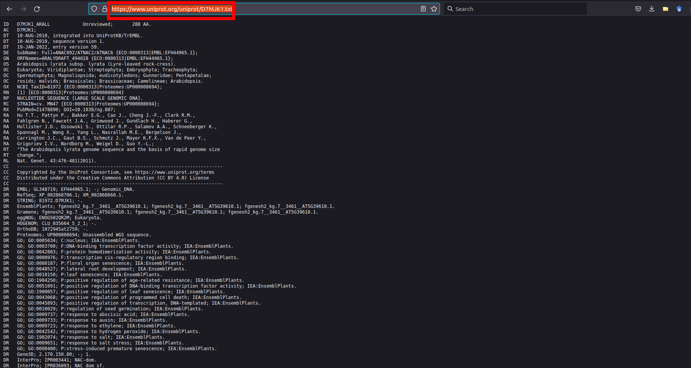
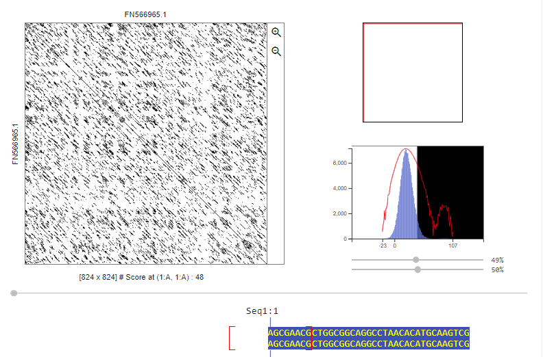
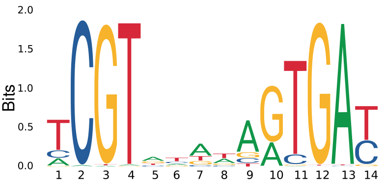

# Introducão à bioinformática - CEN0485 
Aulas práticas da disciplina ["CEN0485 - Introducão à Bioinformática"](https://uspdigital.usp.br/jupiterweb/obterDisciplina?nomdis=&sgldis=cen0485)

__Criador e Instrutor__
Diego M. Riaño-Pachón

# Bioinformática

Os exercícios serão realizados nos computadores da sala de computadores da central de aulas do CENA/USP. Por favor, entre no computador usando o sistema operacional Ubuntu e o usuário cen0485.

## Bioinfo 1 - Operacoes básicas em Bioinformática

### Ferramentas do Unix úteis na bioinformática.

Após adquirir alguma familiaridade com os fundamentos do [sistema operacional Linux](unix.md), vamos explorar como alguns de seus comandos mais básicos podem ser extremamente úteis na área de bioinformática. Você entenderá por que o Linux é o sistema operacional de escolha na bioinformática.

Para realizar esses exercícios, você precisa usar o arquivo [file1.tar.gz](https://github.com/labbces/cen0485/raw/main/files/file1.tar.gz). Após baixá-lo, o arquivo deve estar na sua pasta "Downloads". Você deve descompactá-lo em seu diretório HOME.

```
cd
mv ~/Downloads/file1.tar.gz ~/
tar xvzf file1.tar.gz
```

#### Algumas operações básicas com arquivos.

Usando alguns comandos do UNIX, podemos obter informações sobre arquivos e o conteúdo deles de forma rápida e eficiente, muitas vezes sem a necessidade de abrir o arquivo, que pode ser muito grande, para obter essas informações.

No subdiretório "~/dia1/", encontre o arquivo "TAIR10_pep_20101214_updated.fasta.gz", que corresponde à base de dados de sequências de proteínas previstas no genoma da planta modelo _Arabidopsis thaliana_. Para saber quantas linhas este arquivo possui, descomprioma o arquivo e conte o número de linhas com os comandos:

```
cd 
cd ~/dia1
gunzip TAIR10_pep_20101214_updated.fasta.gz
wc -l TAIR10_pep_20101214_updated.fasta
```
Pode conhecer o tamnho do arquivo com o comando _ls_:

```
ls -l -h TAIR10_pep_20101214_updated.fasta
```

O que faz a opção -h no comando 'ls'? Consulte a página de manual do _ls_ para saber."

Na maioria das vezes, é importante visualizar o conteúdo do arquivo, seja no início ou no final.  No entanto, devido ao grande tamanho dos arquivos com os quais normalmente se trabalha, não é conveniente abrir o arquivo com nenhum editor de texto, pois isso pode reduzir o tempo de resposta do computador. Podemos visualizar as primeiras ou ultimas linahs de um arquivo de texto com os comandos  _head_ e _tail_ respetivamente

```
head TAIR10_pep_20101214_updated.fasta
tail TAIR10_pep_20101214_updated.fasta
```
Esses comandos mostram as primeirais ou ultimas 10 linhas do arquivo. O que você pode fazer para mostrar um número maior de linhas? Consulte a página de manual do  _head_ 

Repare na saída do comando `head`. Está mostrando um registro de sequência no formato 'fasta'. Este formato é o mais simples para armazenar sequências, tanto de ácidos nucleicos quanto de proteínas. Sua estrutura é muito simples. Cada registro começa com uma linha que tem no seu início o sinal _>_ seguido de uma cadeia de caracteres de comprimento arbitrário que funciona como o identificador da sequência. Em seguida, nas linhas subsequentes, aparece a sequência em si, em quantas linhas forem necessárias.

Pode usar o comando _grep_ para localizar todas as linhas que tem um padrão de texto específico, ou seja, uma cadeia de texto específica. Vamos identificar todas a linas que comecam com o sinal _>_

```
grep ">" TAIR10_pep_20101214_updated.fasta
```

São muitas linhas, vamos usar o _pipe_ para examinar só as primeiras 4 linas com o padrão de texto:

```
grep ">" TAIR10_pep_20101214_updated.fasta | head -n 4
```

##### Fasta

O formato mais simples é conhecido como Fasta. Nele, uma entrada, que é uma sequência, é dividida em duas partes: a linha de identificação, que deve começar com o símbolo ">" seguido imediatamente pelo identificador da sequência, que pode ser qualquer cadeia de caracteres sem espaços. As linhas imediatamente após o identificador correspondem à própria sequência.

O formato Fasta é o formato de sequências mais amplamente utilizado em aplicações de bioinformática.

```
>gi|110742030|dbj|BAE98952.1| putative NAC domain protein [Arabidopsis thaliana]
MEDQVGFGFRPNDEELVGHYLRNKIEGNTSRDVEVAISEVNICSYDPWNLRFQSKYKSRDAMWYFFSRRE
NNKGNRQSRTTVSGKWKLTGESVEVKDQWGFCSEGFRGKIGHKRVLAFLDGRYPDKTKSDWVIHEFHYDL
LPEHQRTYVICRLEYKGDDADILSAYAIDPTPAFVPNMTSSAGSVVNQSRQRNSGSYNTYSEYDSANHGQ
QFNENSNIMQQQPLQGSFNPLLEYDFANHGGQWLSDYIDLQQQVPYLAPYENESEMIWKHVIEENFEFLV
DERTSMQQHYSDHRPKKPVSGVLPDDSSDTETGSMIFEDTSSSTDSVGSSDEPGHTRIDDIPSLNIIEPL
HNYKAQEQPKQQSKEKVISSQKSECEWKMAEDSIKIPPSTNTVKQSWIVLENAQWNYLKNMIIGVLLFIS
VISWIILVG
```

##### GenBank

O formato GenBank é utilizado pelo 'National Center for Biotechnology Information' ([NCBI](https://www.ncbi.nlm.nih.gov/)), o maior repositório de sequências de ácidos nucleicos e proteínas do mundo. O NCBI, juntamente com o [EMBL-EBI](https://www.ebi.ac.uk/) e o [DDBJ](https://www.ddbj.nig.ac.jp/), mantém conjuntamente o 'The International Nucleotide Sequence Database' ([Mizrachi, 2008](https://pubmed.ncbi.nlm.nih.gov/27896718/)).

Uma entrada neste formato é composta por duas partes. A primeira parte abrange as posições de 1 a 10 e geralmente contém o nome do campo, como LOCUS, DEFINITION, ACCESSION ou SOURCE. A segunda parte de cada entrada contém informações correspondentes ao campo em questão. Cada entrada é finalizada com o símbolo '//'. Você pode encontrar mais informações sobre esse tipo de arquivo [aqui](http://www.ncbi.nlm.nih.gov/Sitemap/samplerecord.html).

```
LOCUS       BAE98952                 429 aa            linear   PLN 27-JUL-2006
DEFINITION  putative NAC domain protein [Arabidopsis thaliana].
ACCESSION   BAE98952
VERSION     BAE98952.1
DBSOURCE    accession AK226863.1
KEYWORDS    .
SOURCE      Arabidopsis thaliana (thale cress)
  ORGANISM  Arabidopsis thaliana
            Eukaryota; Viridiplantae; Streptophyta; Embryophyta; Tracheophyta;
            Spermatophyta; Magnoliopsida; eudicotyledons; Gunneridae;
            Pentapetalae; rosids; malvids; Brassicales; Brassicaceae;
            Camelineae; Arabidopsis.
REFERENCE   1
  AUTHORS   Totoki,Y., Seki,M., Ishida,J., Nakajima,M., Enju,A., Morosawa,T.,
            Kamiya,A., Narusaka,M., Shin-i,T., Nakagawa,M., Sakamoto,N.,
            Oishi,K., Kohara,Y., Kobayashi,M., Toyoda,A., Sakaki,Y.,
            Sakurai,T., Iida,K., Akiyama,K., Satou,M., Toyoda,T., Konagaya,A.,
            Carninci,P., Kawai,J., Hayashizaki,Y. and Shinozaki,K.
  TITLE     Large-scale analysis of RIKEN Arabidopsis full-length (RAFL) cDNAs
  JOURNAL   Unpublished
REFERENCE   2  (residues 1 to 429)
  AUTHORS   Totoki,Y., Seki,M., Ishida,J., Nakajima,M., Enju,A., Morosawa,T.,
            Kamiya,A., Narusaka,M., Shin-i,T., Nakagawa,M., Sakamoto,N.,
            Oishi,K., Kohara,Y., Kobayashi,M., Toyoda,A., Sakaki,Y.,
            Sakurai,T., Iida,K., Akiyama,K., Satou,M., Toyoda,T., Konagaya,A.,
            Carninci,P., Kawai,J., Hayashizaki,Y. and Shinozaki,K.
  TITLE     Direct Submission
  JOURNAL   Submitted (26-JUL-2006) Motoaki Seki, RIKEN Plant Science Center;
            1-7-22 Suehiro-cho, Tsurumi-ku, Yokohama, Kanagawa 230-0045, Japan
            (E-mail:mseki@psc.riken.jp, URL:http://rarge.gsc.riken.jp/,
            Tel:81-45-503-9625, Fax:81-45-503-9586)
COMMENT     An Arabidopsis full-length cDNA library was constructed essentially
            as reported previously (Seki et al. (1998) Plant J. 15:707-720;
            Seki et al. (2002) Science 296:141-145).
            This clone is in a modified pBluescript vector.
            Please visit our web site (http://rarge.gsc.riken.jp/) for further
            details.
FEATURES             Location/Qualifiers
     source          1..429
                     /organism="Arabidopsis thaliana"
                     /db_xref="taxon:3702"
                     /chromosome="1"
                     /clone="RAFL08-19-M04"
                     /ecotype="Columbia"
                     /note="common name: thale cress"
     Protein         1..429
                     /product="putative NAC domain protein"
     Region          5..137
                     /region_name="NAM"
                     /note="No apical meristem (NAM) protein; pfam02365"
                     /db_xref="CDD:426740"
     CDS             1..429
                     /gene="At1g01010"
                     /coded_by="AK226863.1:89..1378"
ORIGIN      
        1 medqvgfgfr pndeelvghy lrnkiegnts rdvevaisev nicsydpwnl rfqskyksrd
       61 amwyffsrre nnkgnrqsrt tvsgkwkltg esvevkdqwg fcsegfrgki ghkrvlafld
      121 grypdktksd wvihefhydl lpehqrtyvi crleykgdda dilsayaidp tpafvpnmts
      181 sagsvvnqsr qrnsgsynty seydsanhgq qfnensnimq qqplqgsfnp lleydfanhg
      241 gqwlsdyidl qqqvpylapy enesemiwkh vieenfeflv dertsmqqhy sdhrpkkpvs
      301 gvlpddssdt etgsmifedt ssstdsvgss depghtridd ipslniiepl hnykaqeqpk
      361 qqskekviss qksecewkma edsikippst ntvkqswivl enaqwnylkn miigvllfis
      421 viswiilvg
//
```

#### Algumas operações básicas com sequências no formato Fasta

Durante o restante desta seção e na próxima, usaremos apenas sequências no formato Fasta. Por favor, verifique se as sequências de _A. thaliana_ no arquivo 'TAIR10_pep_20101214_updated.fasta' estão neste formato. Você pode usar o comando `head nome_do_arquivo` ou o comando `less nome_do_arquivo` para fazer isso.

Você já teve que contar o número de sequências num arquivo ou alterar o identificador das sequências no formato Fasta? Se fossem apenas algumas sequências, isso poderia ser feito facilmente em qualquer editor de texto. No entanto, quando se trata de milhares de sequências, a opção de usar um editor de texto deixa de ser viável. Felizmente, alguns comandos do Unix nos permitem realizar essas tarefas simples de forma rápida.

Como observado anteriormente, o comando `grep` pode nos ajudar a contar o número de sequências em um arquivo Fasta. O modificador `-c` conta o número de linhas que contêm um padrão específico em um arquivo, e podemos aproveitar o fato de que em um arquivo Fasta o símbolo _>_ aparece uma única vez para cada sequência. Para contar o número de sequencias armazenadas no arquivo pode usar o comando:

```
grep -c ">" TAIR10_pep_20101214_updated.fasta
```

Em outras situações, é importante modificar o identificador de cada sequência para incluir, por exemplo, uma abreviatura que represente o nome da espécie à qual a sequência pertence. Novamente, o Unix nos permite fazer essa alteração rapidamente usando o comando `sed`. Vamos adicionar a partícula 'ATH' a cada um dos identificadores do arquivo, aproveitando o fato de que à esquerda de cada identificador temos o símbolo '>'. Observe que os resultados desta operação estão sendo armazenados em um novo arquivo:

```
sed 's/>/>ATH_/' TAIR10_pep_20101214_updated.fasta > TAIR10_pep_20101214_updated.mod.fasta
```
As linhas com os identificadores neste arquivo são muito extensas, para muitos programas isto não é desejável. Vamos eliminar tudo que aparecer depois do primeiro ' |'. Para isso vamos usar [regular expressions](https://www.gnu.org/software/sed/manual/html_node/Regular-Expressions.html).

```
sed -r 's/ | .*$//' TAIR10_pep_20101214_updated.mod.fasta > TAIR10_pep_20101214_updated.mod2.fasta
```

### Buscas em banco de dados biológicos

#### NCBI – Bancos de dados e busca de informações

O National Center for Biotechnology Information (NCBI), uma instituição pública dos Estados Unidos, é responsável por armazenar informações sobre os genomas de diversas espécies, além de manter o maior banco de dados público de sequências de DNA e proteínas. Sua página principal pode ser acessada pelo seguinte link: http://www.ncbi.nlm.nih.gov/. Este site interliga todos os dados disponíveis em seus servidores, incluindo PubMed, todos os bancos de dados (Entrez), Blast, OMIM, Books, TaxBrowser, Structure, como ilustrado na figura. Embora o Entrez esteja listado como um dos serviços, na realidade, quase todos eles dependem diretamente do Entrez. Por exemplo, PubMed e Taxonomy estão intimamente ligados ao Entrez.

Vamos começar uma visita aos seus bancos de dados. Como primeiro passo, vamos acessar o PubMed. Esta base de dados contém informações sobre publicações científicas, cujos registros foram compilados pela National Library of Medicine (NLM), com a colaboração dos editores. Lá, você encontrará a maioria das referências necessárias, incluindo o resumo (Abstract) e, em alguns casos, o acesso gratuito à publicação. Para obter ajuda sobre como realizar buscas, consulte o seguinte link: http://www.ncbi.nlm.nih.gov/bookshelf/br.fcgi?book=helppubmed. As páginas possuem um menu de banco de dados em uma barra superior, e as pesquisas devem ser inseridas na janela mostrada na figura Uma busca deve seguir um formato semelhante a este:

__palavrachave__[campo] operador lógico __palavrachave__[field] . . .


Onde "palavra-chave" é a palavra utilizada para identificar um registro de acordo com o campo utilizado. Por exemplo, uma palavra-chave pode ser "Silva" no campo "authors". Operador lógico é qualquer um destes operadores booleanos: AND, OR, NOT, etc. Ao substituir por suas próprias palavras-chave no formato acima, lembre-se de que os campos devem estar entre colchetes [ ], mas os operadores são independentes (sem os símbolos), além disso, as aspas na palavra-chave são opcionais, mas servem para forçar uma busca pela palavra exata em vez de uma busca flexível. Por exemplo, se eu quiser pesquisar todos os artigos de 1999 publicados por Silva et al. na revista Science, eu uso o seguinte comando: "Silva"[AU] AND 1999[DP] AND "Science"[TA]. Quanto mais informações forem inseridas na busca, mais restrita será a resposta (por exemplo, se eu incluir mais autores). Os campos mais comuns que podem ser solicitados no PubMed são os seguintes:

* __All Fields [ALL]__ inclui todos os campos pesquisáveis do PubMed. Contudo, somente os termos que não encontrarem correspondência em uma das tabelas ou índices de tradução pelo processo de Mapeamento Automático de Termos serão pesquisados em Todos os Campos. O PubMed ignora palavras irrelevantes em consultas de pesquisa.

* __Author Name [AU]__ existe um limite no número de nomes de autores incluídos na citação MEDLINE, que variou ao longo dos anos (veja a política da NLM sobre nomes de autores). O MEDLINE não lista o nome completo. O formato para pesquisar pelo nome do autor é: sobrenome seguido de espaço e até as duas primeiras iniciais, seguido de espaço e abreviação do sufixo, se aplicável, tudo sem pontos ou vírgulas após o sobrenome (por exemplo, Fauci AS ou O’Brien JC Jr). Iniciais e sufixos podem ser omitidos na busca. O PubMed automaticamente trunca o nome de um autor para considerar iniciais variadas, por exemplo, "O’Brien J [AU]" recuperará "O’Brien JA", "O’Brien JB", "O’Brien JC Jr", bem como "O’Brien J". Para desativar esse truncamento automático, coloque o nome do autor entre aspas duplas e qualifique com [au] entre colchetes, por exemplo, "O’Brien J"[AU] para recuperar apenas "O’Brien J".

* __EC/RN Number [RN]__ é o número atribuído pela Enzyme Commission para designar uma enzima específica ou pelo Chemical Abstracts Service (CAS) para números de registro.

* __Entrez Date [EDAT]__ é a data em que a citação foi adicionada ao banco de dados PubMed. As citações são exibidas por ordem de data de entrada, com as mais recentes primeiro. As datas ou intervalos de datas devem ser inseridos no formato AAAA/MM/DD [edat], ex. 1998/04/06 [edat]. O mês e o dia são opcionais (por exemplo, 1998 [edat] ou 1998/03 [edat]). Para intervalos de datas, use dois pontos (:) entre as datas (por exemplo, 1996:1997 [edat] ou 1998/01:1998/04 [edat]).

* __Issue [IP]__ é o número da edição da revista na qual o artigo foi publicado.

* __Journal Title [TA]__ é a abreviatura do título do periódico, o nome completo do periódico ou número ISSN.

* __Language [LA]__ especifica o idioma da publicação.

* __Publication Date [DP]__ é a data em que o artigo foi publicado. As datas ou intervalos de datas devem ser pesquisados usando o formato AAAA/MM/DD [dp], ex. 1998/03/06 [dp]. O mês e o dia são opcionais (por exemplo, 1998 [dp] ou 1998/03 [dp]). Para intervalos de datas, insira dois pontos (:) entre as datas (por exemplo, 1996:1998 [dp] ou 1998/01:1998/04 [dp]).

* __Text Words [TW]__ inclui todas as palavras e números no título e resumo, além de termos MeSH, subtítulos, nomes de substâncias químicas, nome pessoal como assunto e o campo de Fonte Secundária (Secondary Source ID, SI) do MEDLINE. O campo "Nome pessoal como assunto" também pode ser pesquisado diretamente usando a tag de campo de pesquisa [ps], por exemplo, "rouxinol f [ps]".

* __Title Words [TI]__ abrange palavras e números incluídos no título de uma citação.

* __Title/Abstract Words [TIAB]__ engloba palavras e números presentes tanto no título quanto no resumo de uma citação.

* __Unique Identifiers [UID]__ são identificadores únicos atribuídos a cada registro no PubMed.

* __Volume [VI]__ refere-se ao número do volume da revista em que um artigo foi publicado.

Agora, vamos acessar o site onde o ENTREZ está localizado. Para fazer isso, selecione "TODOS OS BANCOS DE DADOS" na janela do banco de dados na página principal. O Entrez é um sistema de busca para sequências armazenadas em bancos de dados. Consultas sofisticadas podem ser feitas para obter um conjunto de sequências de seu interesse. Por exemplo, é possível solicitar a exibição de todas as sequências genômicas de Arabidopsis que foram incluídas no banco de dados entre os anos de 1997 e 1999, e que também contêm anotações (na tabela "features") nas regiões promotoras. A seguinte figura mostra a página de login do servidor Entrez.


Assim, em um único site, podemos realizar buscas simultaneamente em todas as bases de dados ou selecionar uma única base de dados para realizar uma busca específica. Na caixa de busca, as sequências podem ser consultadas usando seus números identificadores (como o GI number ou o número de acesso). Questões mais complexas também podem ser formuladas usando a sintaxe do Entrez, de maneira semelhante ao que vimos no PubMed:
  
__palavrachave__[campo] operador lógico __palavrachave__[field] . . .

Para obter mais informações sobre o Entrez, você pode acessar o link: http://www.ncbi.nlm.nih.gov/bookshelf/br.fcgi?book=helpentrez&part=EntrezHelp.

##### Exercícios

1. Qual é a classificação taxonômica da alga Chlamydomonas reinhardtii e quais outras plantas estão próximas, que possam ser usadas como fonte de marcadores? Quantas sequências de proteínas estão presentes no GenBank para a espécie Chlamydomonas reinhardtii?

2. Acesse a página do PubMed e obtenha referências que tratam da biologia molecular e/ou genética da mandioca (Manihot esculenta). Quantos artigos foram publicados nos últimos dois anos e de quais laboratórios (ou regiões geográficas) são os autores? Explique como você realizou a pesquisa.

3. Utilize o Entrez para encontrar todas as sequências EST (Expressed Sequence Tag) de arroz que foram depositadas no banco de dados.

#### Quais bancos de dados encontramos no NCBI?

O NCBI possui um grande número de bancos de dados, sendo o mais conhecido o GenBank, que contém todas as sequências de nucleotídeos. O GenPept contém as sequências de proteínas. Outras bases de dados incluem Genome, Structure e PubMed. 

##### GenBank

No GenBank, as sequências estão organizadas em 17 divisões, sendo 11 tradicionais e 6 Bulk. Nas divisões tradicionais, as sequências foram enviadas diretamente pelos pesquisadores e são caracterizadas, e as divisões são:

- PRI primatas
- PLN plantas
- BCT bactérias
- INV invertebrados
- ROD Roedores
- VRL Viral
- VRT outros vertebrados
- MAM Mamíferos (Ej. ROD + PRI)
- PHG Fagos
- SYN Sintético (vetores de clonagem, etc)
- UNA sem anotacãao

O Bulk consiste em sequências enviadas em grupos, por email ou FTP, que podem ser imprecisas e mal caracterizadas. Entre elas estão:

- __dbEST (Banco de Dados de EST, Tags de Sequências Expressas)__: Contém sequências expressas, fornecendo uma visão rápida da expressão gênica em diferentes condições ou tecidos.

- __dbSTS (Sequence-Tagged Sites)__: São marcadores genômicos curtos para os quais existem informações de sequência e de mapa, utilizados em mapeamento genético e localização de genes.

- __dbGSS (Genomic Survey Sequences)__: Inclui dados de sequência de genoma de etapa única, sequências terminais de BAC, YAC e cosmídeos, e sequências de exon, contribuindo para o mapeamento genômico.

- __dbHTGS (High-Throughput Genomic Sequences)__: Foi criado para armazenar informações de sequenciamento de genoma que ainda não foram finalizadas ou curadas, com o objetivo de torná-las disponíveis para a comunidade científica assim que possível.

Também existem bancos de dados específicos para:

- __HTC (High Throughput cDNA)__: Sequências de cDNA geradas em alta escala, úteis para estudos de expressão gênica e identificação de novos genes.

- __PAT (Patent)__: Sequências relacionadas a patentes, incluindo informações genéticas e biotecnológicas importantes para a propriedade intelectual e o desenvolvimento de novas tecnologias.

##### RefSeq

Queremos dar ênfase especial a um banco de dados do NCBI chamado RefSeq. Esse banco de dados foi criado para fornecer uma coleção biologicamente não redundante de sequências de DNA, RNA e proteínas. Cada RefSeq (sequência de referência) representa uma molécula única que ocorre naturalmente em um organismo. Essa base de dados é curada por pesquisadores, onde cada molécula não é um resultado de pesquisa direto, mas sim uma síntese de informações.

Vamos retornar à página principal do NCBI e, na janela de busca, deixando "all databases" selecionado, digite NC_001139. Verificamos que em Nucleotide temos 1 resultado, assim como em Genome, e em Gene temos 631 resultados.

Ao abrir Nucleotide, obtemos um flatfile de sequência que corresponde à sequência completa do cromossomo VII da levedura. Ao examinar o arquivo flatfile, podemos ver que ele contém várias informações. Quais são elas?

É importante notar que os identificadores nesta base de dados mudam e são do tipo 2+6, com duas letras seguidas de 6 números. A tabela a seguir nos mostrará o que essas letras significam:


#### Recuperação de Sequências no NCBI com Buscas Mais Específicas

Se conhecemos o organismo, as buscas no NCBI podem ser mais direcionadas. Acessando a página inicial do NCBI, vamos para o TaxBrowser e inserimos o nome do organismo que estamos procurando. Ao selecioná-lo, uma tabela com o número de sequências por tipo de molécula ou projeto aparece à direita. Clicar em uma das opções, como proteínas, nos direciona diretamente às proteínas daquele organismo.

Se sabemos os números de acesso, podemos inseri-los diretamente na janela de pesquisa da página principal do NCBI. Para várias sequências, os números são colocados com a palavra "OR" entre eles, por exemplo, AJ487842 OR AJ487843. Finalmente, para uma sequência de números de acesso, digite: AJ487842::AJ487851[ACCN].

Direcionamos a Pesquisa com Limites. Por exemplo, se eu quiser pesquisar as sequências de mRNA curadas relacionadas a um tipo de câncer em humanos, posso realizar a seguinte pesquisa: na janela de busca, digito "COLON CANCER AND NONPOLYPOSIS" e pesquiso no banco de dados de nucleotídeos. Então, em "Limits", seleciono a molécula de mRNA e em "only from" escolho RefSeq. Depois, vou para a janela "Preview/Index" acima e, em "Organismos", digito "humanos" e seleciono "AND".


## EMBOSS

[EMBOSS](https://emboss.sourceforge.net/), "The European Molecular Biology Open Software Suite", é um pacote de código aberto gratuito composto por centenas de aplicativos desenvolvidos especificamente para as necessidades da comunidade de biologia molecular. As áreas abrangidas pelas aplicações EMBOSS incluem alinhamento de sequências, pesquisa em bancos de dados usando padrões, identificação de motivos proteicos e análise de uso de códons. 

Você encontra descricoes dos pacotes de EMBOSS neste [link](https://emboss.sourceforge.net/apps/release/6.6/emboss/apps/).

###  Recuperando sequências de bancos de dados

A recuperação de sequências de um banco de dados depende dos bancos disponíveis.

Vamos recuperar a sequência do gene ANAC092 do banco de dados de proteínas UniProt. Para isso  é necessário acessar o site do [UniProt](https://www.uniprot.org/) e localizar o identificador correto. 




Com o identificador apropriado, também podemos baixar a sequência em formato .txt, utilizando o comando wget.

```bash
wget https://www.uniprot.org/uniprot/D7MJK1.txt
```

Na sua tela deve aparecer algo semelhante ao seguinte quadro:

```
--2022-04-06 14:23:06-- https://www.uniprot.org/uniprot/D7MJK1.txt
3 Resolving www.uniprot.org (www.uniprot.org)... 193.62.193.81
4 Connecting to www.uniprot.org (www.uniprot.org)|193.62.193.81|:443... connected.
5 HTTP request sent, awaiting response... 200
6 Length: 4570 (4,5K) [text/plain]
7 Saving to: ‘D7MJK1.txt’
8 D7MJK1.txt 100%[===================>] 4,46K --.-KB/s in 0s
9 2022-04-06 14:23:08 (275 MB/s) - ‘D7MJK1.txt’ saved [4570/4570]
```

Em seguida, usaremos um programa da suíte EMBOSS para alterar o formato do registro baixado do UniProt. O programa utilizado será o "seqret". Você pode usar o comando "wossname" para procurar programas do EMBOSS que contenham em sua descrição uma palavra-chave específica. Antes de usar os programas do EMBOSS, é necessário ativar o ambiente que contém o software instalado em seu computador.

```bash
conda activate emboss
```

Note que seu prompt mudiou, agora exibindo o nome do ambiente ativado, neste caso, emboss. Lembre-se de desativar o ambiente quando terminar de usá-lo, para retornar ao estado original do seu sistema, usando o comando:

```bash
conda deactivate
```

Agora, você pode usar o mesmo programa, "seqret", para converter o arquivo .txt recuperado do UniProt para o formato FASTA. Consulte a pagina de manual do seqret para aprender sua sintaxe.  Descreva como pode converte a formato Fasta. 

Após ter sua sequência em formato fasta, para fazer cálculos sobre essas sequências, utilize o programa "compseq" do EMBOSS, que permite calcular a composição de palavras em uma sequência.  Calcule a frequência de monômeros e dímeros na sequência do ANAC092.

 Existe alguma diferença entre o valor observado e o esperado das frequências de dímeros. O valor esperado para cada dímero vem de qual fonte?

### Seleção de quadros de leitura aberta

Um quadro de leitura aberta (ou [ORF de "Open Reading Frame"](https://en.wikipedia.org/wiki/Open_reading_frame)) refere-se a uma parte de uma sequência de ácidos nucléicos que pode ser traduzida em proteínas. Este segmento começa com um códon de início (usualmente AUG, que codifica a metionina) e termina com um códon de parada, sem quaisquer outros códons de parada entre eles. O ORF determina como os nucleotídeos são agrupados em códons, que por sua vez são traduzidos em aminoácidos para formar proteínas.

Os programas __getorf__ e __plotorf__ identificam ORFs em sequências de nucleotídeos. Um QLA é uma sequência (ou subsequência) de um comprimento mínimo especificado, delimitada por códons de parada ou por um códon de início e um de parada. iA pesar da universalidade do código genético, existem variações entre alguns grupos de organismos, por isso é crucial especificar o código genético utilizado para a tradução da sequência ou os códons de início e parada permitidos.

 Use os programas getorf e plotorf para identificar o quadro de leitura aberto correto da sequência "[ANAC092_cDNA.fa](https://raw.githubusercontent.com/labbces/cen0485/main/files/ANAC092_cDNA.fa)". Verifique se existe alguma diferença nos resultados fornecidos por ambos os programas. Descreva o processo que realizou.

### Embaralhar/misturar Sequências

Ao realizar certos tipos de análise, por exemplo, a busca por sítios de ligação a fatores de transcrição em sequências de promotores (TFBS), é essencial ter um grupo de sequências como controle negativo, i.e., onde não é esperado encontrar o sitio de ligação. Uma prática comum é gerar sequências aleatórias que mantenham a composição monomérica das sequências originais. O programa "shuffleseq" realiza essa tarefa, embaralhando os monômeros de uma sequência "real" para produzir uma sequência aleatória. Geralmente, são geradas 1000 sequências aleatórias para cada sequência original.

 Use o "shuffleseq" para gerar duas sequências aleatórias a partir do rRNA encontrado no arquivo [FN566965.fasta](https://raw.githubusercontent.com/labbces/cen0485/main/files/FN566965.fasta).  Calcule as frequências de dímeros da sequência original e das duas sequências aleatórias. Verifique se há diferenças. As diferenças, se encontradas, podem ser explicadas pela variabilidade aleatória. Explique! [exercicio](linux/Figs/f03c15.png) Descreva o processo.

 Realize uma busca na literatura e encontre um artigo onde sejam utilizadas sequências aleatórias para testar alguma hipótese. Descreva brevemente o trabalho e como as sequências aleatórias foram utilizadas, deixando uma referência clara do artigo para facilitar sua localização.

## Comparação de Sequências I - Matrizes de pontos

As matrizes de pontos (“Dot Plot”) são ferramentas exploratórias para comparar strings de texto, ou seja, sequências. Entre outros, eles nos permitem encontrar facilmente regiões repetidas em uma sequência comparando-a com ela mesma. Também podemos ter uma boa ideia da estrutura de um gene comparando a sequência de sua região de codificação com a sequência do locus onde se encontra. 

Nesta seção, usaremos a implementação de matrizes de pontos do Instituto Suı́ço de Bioinformática, conhecida como [DotLet](https://dotlet.vital-it.ch/), que vemos na seguinte figura:


Vamos a comparar a sequencia [FN566965](https://raw.githubusercontent.com/labbces/cen0485/main/files/FN566965.fasta) contra ela mesma. A figura abaixo mostra como dar um nome à sequência e colá-la na caixa correspondente:


De volta à janela DotLet vemos que encontramos dois botões habilitados, eles agora aparecem com o nome da sequência que você acabou de adicionar. Uma delas representa a sequência que aparece na direção horizontal, a outra a sequência que aparece na direção vertical.

À direita dos botões/listas que identificam as sequências, encontramos dois parametros importantes, o tamanho de janela e matriz de substituição/pontoação. O que significam esses parametros?  Descreva o que você entendeu sobre eles.

Uma vez calculada a matriz de pontos, observamos duas seções de resultados. A região à esquerda mostra a própria matriz, em que pixels escuros representam pontuações baixas, ou seja, indesejáveis. À esquerda, visualizamos um histograma da frequência de cada pontuação. Manipulando este histograma, por meio das barras de rolagem horizontais, é possível ajustar a exibição da matriz de pontos.



-  Explique como o tamanho da janela afeta a exibição na matriz de pontos.
-  Qual é o significado da linha rosa no histograma de pontuação?
-  Compare a sequência de [cDNA](https://raw.githubusercontent.com/labbces/cen0485/main/files/ANAC092_cDNA.fa) e sua contraparte [genômica de ANAC092](https://raw.githubusercontent.com/labbces/cen0485/main/files/ANAC092_genomic.fasta). Descreva os resultados.

O DotLet é um programa básico para a criação de matrizes de pontos que, infelizmente, não consegue lidar com alguns casos mais complexos, como por exemplo, a visualização de regiões repetidas invertidas nas sequências comparadas. Por essa razão, optaremos por utilizar outro programa para matrizes de pontos, desta vez acessível a partir da linha de comando.

Vamos usar o programa [Re-Dot-Table](https://www.bioinformatics.babraham.ac.uk/projects/redotable/) para comparar a sequência do arquivo [secondarystructure.fasta](https://raw.githubusercontent.com/labbces/cen0485/main/files/secondarystructure.fasta) com ela mesma.

Esta sequência adquire a estrutura secundária que aparece abaixo. Nesta estrutura, as regiões que formam stems correspondem a repetições invertidas, que podem ser visualizadas como diagonais com inclinação oposta à diagonal principal no dotplot.


Para gerar o dotplot com o software Re-Dot-Table, é necessário ativar um ambiente Conda no qual o software foi previamente instalado e, em seguida, executar o aplicativo:
  
```bash 
conda activate redotable
redotable
```

A seguinte figura mostra o resultado dessa comparação. Explore o efeito do tamanho da janela para gerar o dotplot.


Ao terminar lembre-se de desativar seu ambiente:

```bash
conda deactivate
```

-  Explique como o tamanho da janela afeta a exibição na matriz de pontos.
-  Qual é o significado das linhas azuis e vermelhas na matriz de pontos?

Encontre quais programas do EMBOSS conseguem criar dotplots. Pode usar o pacote wossname para fazer buscas com palavras-chave na descrição dos programas de EMBOSS. Lembre-se de ativar o ambiente de EMBOSS.

```bash
conda activate emboss
```

Recupere do [NCBI](https://www.ncbi.nlm.nih.gov/) as sequencias NM_214647 e NW_732498. Crie um dotplot com as sequências de cDNA (NM_214647) e genômica (NW_732498) e : descreva as sequências, por exemplo, em qual banco de dados estavam disponiveis, o organismo de origem, seus comprimentos; em seguida, descreva o procedimento para realizar o dotplot, como a seleção de parâmetros e, finalmente, descreva seus resultados.

Não esqueça de desativar o ambiente de EMBOSS.

```bash
conda deactivate
```

## Comparação de Sequências II - Alinhamentos de pares de sequências

Algumas partes deste capı́tulo vêm do tutorial disponivel neste [link](http://emboss.sourceforge.net/docs/emboss_tutorial/emboss_tutorial.pdf).

Para realizar os exercícios deste capítulo, lembre-se de ativar o ambiente conda do EMBOSS, conforme demonstrado na linha a seguir.

```bash
conda activate emboss
```

Quando terminar os exercícios, ou antes de ativar outro ambiente, lembre-se de desativar o ambiente atualmente ativo:

```bash
conda deactivate
```
### Matrizes de substituição

Vamos procurar, dentro da suíte do EMBOSS, o arquivo com a matriz de substituição PAM250. Para isso, você pode executar o seguinte comando:

```bash
embossdata EPAM250
```

Você obterá uma saída na sua tela semelhante à seguinte:

```
Find and retrieve EMBOSS data files
# The following directories can contain EMBOSS data files.
# They are searched in the following order until the file is found.
# If the directory does not exist, then this is noted below.
# '.' is the UNIX name for your current working directory.

File ./EPAM250                                                    Does not exist
File .embossdata/EPAM250                                          Does not exist
File /home/diriano/EPAM250                                        Does not exist
File /home/diriano/.embossdata/EPAM250                            Does not exist
File /usr/share/EMBOSS/data/EPAM250                               Exists
```

O que esperamos encontrar é o caminho onde o arquivo EPAM250 está armazenado. Observe que, em uma das linhas, a última palavra é 'Exists', indicando que o arquivo se encontra naquele local. Selecione o caminho do arquivo e visualize-o com o comando 'less':

```
less /usr/share/EMBOSS/data/EPAM250 
```

Responda:

-  Quem, e como, criou a famı́lia PAM de matrizes de substituição?
-  Onde estão as maiores pontuações? Explicar.
-  Qual é a substituição com a maior pontuação?
-  Por que as identidades não têm sempre a mesma pontuação?

### Alinhamento Global

No alinhamento global, o objetivo é comparar duas sequências ao longo de toda a sua extensão. Portanto, é apropriado quando esperamos que a semelhança entre as duas sequências se estenda por toda a sequência. No pacote EMBOSS, você encontrará o aplicativo 'needle', que implementa rigorosamente o algoritmo de [Needleman e Wunsch (1970)](https://doi.org/10.1016/0022-2836(70)90057-4) para obter o alinhamento global ideal por meio de programação dinâmica. Esta implementação pode demorar algum tempo para obter o alinhamento quando as sequências são longas.

-  Quais outros aplicativos no EMBOSS permitem que você faça alinhamentos globais? 
-  O que os torna diferentes de 'needle'?
-  Faça um alinhamento global entre o [cDNA](https://raw.githubusercontent.com/labbces/cen0485/main/files/ANAC092_cDNA.fa) e a sequência [genômica](https://raw.githubusercontent.com/labbces/cen0485/main/files/ANAC092_genomic.fasta) do gene ANAC092.
-  Qual matriz de substituições e penalidades para abrir e estender GAPs que você usou? Ex-
plicar.
-  Qual é a pontuação do alinhamento, seu comprimento e as porcentagens de identidade e
semelhança?
-  Explique a diferença entre semelhança e identidade.
-  O que significam os sı́mbolos? :, . y |?

Compare as sequências de aminoácidos das proteinas [ANAC092_pep.fasta](https://raw.githubusercontent.com/labbces/cen0485/main/files/ANAC092_pep.fasta) e [Pp3c6_27690](https://phytozome-next.jgi.doe.gov/report/gene/Ppatens_v3_3/Pp3c6_27690), codificadas por dois genes da família NAC de fatores de transcrição, em _Arabidopsis lyrata_ e no musgo _Physcomitrella patens_, respectivamente.

-   Realize um alinhamento global entre as sequências de aminoácidos das proteínas NAC de _Arabidopsis lyrata_ e do musgo _Physcomitrella patens_.
-  Qual matriz de substituições e de penalidades utilizadas para abrir e estender gaps usou? Por favor, explique sua escolha.
-  Qual é a pontuação do alinhamento, seu comprimento, e quais são os percentuais de identidade e semelhança obtidos?
-  É possível melhorar o alinhamento ajustando outros parâmetros? Discuta suas opções.

### Alinhamento local

Conforme mencionado na seção anterior, o alinhamento global compara sequências ao longo de todo o seu comprimento. É necessário decidir se essa estratégia é a mais adequada para cada caso específico. O que aconteceria se você comparasse duas proteínas multidomínio que compartilham apenas um domínio entre si?

O objetivo do alinhamento local é identificar regiões de similaridade localizada, sem a necessidade de incluir as sequências completas. Esse tipo de alinhamento é particularmente útil para pesquisar em bancos de dados ou quando a semelhança entre a sequência de interesse e as sequências disponíveis no banco de dados não é conhecida.

Dentro do pacote EMBOSS, você encontrará a aplicação 'water', que implementa o algoritmo de [Smith e Waterman (1981)](https://doi.org/10.1016/0022-2836(81)90087-5) para obter o alinhamento local exacto através de programação dinâmica. Esta implementação pode demorar algum tempo para alcançar o alinhamento, especialmente quando as sequências são longas.

-  Que outros aplicativos no EMBOSS permitem que você faça alinhamentos locais? O que os
torna diferentes de water?
-  Faça um alinhamento local entre as sequências de aminoácidos das proteı́nas NAC de _Arabidopsis lyrata_ e do musgo _Physcomitrella patens_, que você usou na seção anterior.
-  Qual a matriz de subtituição e penalidades para abrir e estender gaps que você usou? Explicar.
-  Quais são as diferenças entre o alinhamento global e local dessas duas sequências?

### Significado dos alinhamentos

Independentemente das sequências fornecidas aos programas de alinhamento, eles sempre produzirão um alinhamento. Utilize as sequências de aminoácidos [ANAC092](https://raw.githubusercontent.com/labbces/cen0485/main/files/ANAC092_pep.fasta) e empregue o programa 'shuffleseq' para gerar duas sequências aleatórias com a mesma composição monomérica que ANAC092. Realize um alinhamento global e local com essas duas sequências aleatórias.

-  Qual é a pontuação do alinhamento, seu comprimento, e quais são os percentuais de identidade e semelhança?

Prossiga realizando um alinhamento local e global entre a sequência de aminoácidos de ANAC092 e uma das versões aleatórias.

-  Qual é a pontuação do alinhamento, seu comprimento, e quais são os percentuais de identidade e semelhança?
-  Discurse sobre seus resultados.

### Basic Local Alignment Search Tool - BLAST

A seguinte figura mostra os sabores de BLAST disponiveis no NCBI. Na primeira parte deste tutorial, realizaremos alguns exercícios utilizando esta interface gráfica do BLAST.


O arquivo [desconocido.nuc.fa](https://raw.githubusercontent.com/labbces/cen0485/main/files/desconocido.nuc.fa), contém a sequência nucleotídica de um transcrito descoberta por você ao realizar uma análise de expressão diferencial em _A. thaliana_ sob tratamento com luz ultravioleta (UV-A), condição que induziu este transcrito. Copie a sequência da transcrição e acesse o site http://blast.ncbi.nlm.nih.gov/ através do se navegador navegador web. Vamos conduzir uma pesquisa BLAST básica; procure na página a busca com o programa 'blastx'.  Por que escolher 'blastx'?

No 'blastx', cole sua sequência desconhecida no campo “Enter query sequence” e digite Viridiplantae no campo “Organism” para restringir a busca a sequências de plantas verdes. Certifique-se de que o banco de dados selecionado seja o banco de dados não redundante de sequências proteicas.


Em buscas que envolvem a tradução online de uma sequência de DNA, você pode escolher o código genético a ser utilizado na tradução. Assegure-se de que o código genético selecionado seja o “Standard”. Mais abaixo, clique no link “Algorithm parameters”, o que revelará uma série de opções. Na seção “General parameters”, encontre o limiar esperado ou valor E. O valor E é o número esperado de alinhamentos com uma pontuação igual ou maior que a obtida que apareceriam por acaso. Ao selecionar alinhamentos significativos, este é o parâmetro mais importante; geralmente, alinhamentos com um valor E menor que 1 × 10^−5 representam sequências homólogas. No entanto, se estiver alinhando sequências muito curtas, por exemplo, de 20 resíduos, você deve permitir alinhamentos com um valor E muito alto, cerca de 100. Na seção “Scoring parameters”, você pode selecionar a matriz de substituição (escolha BLOSUM80) e a penalidade por inserir gaps no alinhamento. Observe que existe uma diferença entre o custo de introduzir um gap e o de estendê-lo. Por que essa diferença ocorre? As opções para abrir e estender gaps dependem da matriz de substituição escolhida.


Certifique-se de que a opção Filter na seção Filters and Masking esteja selecionada, a fim de reduzir o número de alinhamentos com sequências evolutivamente não relacionadas. 

Agora clique no botão BLAST e aguarde os resultados.

Os resultados fornecidos pelo BLAST vêm em diferentes apresentações. Primeiro encopntrará uma tabela com os melhores resultados (hits), mostrando o identificador (Número de Acesso) da sequência encontrada, uma parte de sua descrição, a pontoacão do alinhamento entre sua sequência desconhecida (_query_) e a sequência do banco de dados (_subject_), o percentual da sequência _query_ que está representado no alinhamento, a identidade e o valor E. É possível reordenar os dados nesta tabela clicando nos nomes das colunas. 


Também tem acesso a um resumo grafico dos _hits_. Este gráfico é uma representação dos melhores alinhamentos com um código de cores que indica o comprimento do alinhamento. 


Finalmente, você chega aos próprios alinhamentos. Aqui, encontrará novamente o escore e o valor E do alinhamento. Além disso, são apresentados o número de posições em que as duas sequências eram idênticas e similares (conforme a matriz de substituição) e o número de lacunas (gaps).


-  O que indicam as regiões dos alinhamentos que aparecem em cinza e em minúsculas? 
-  O que você pode dizer sobre a função do seu transcrito? Qual informação foi relevante para realizar essa inferência?

A interface web do NCBI BLAST é bastante intuitiva e amigável, entretanto, enfrenta algumas limitações ao se trabalhar com genômica e proteômica: (i) não é possível efetuar buscas em bancos de dados personalizados ou privados e (ii) existe uma limitação no número de sequências que podem ser utilizadas como consulta em cada busca. A solução mais eficiente para superar esses obstáculos é instalar o NCBI BLAST em um computador pessoal e configurar os bancos de dados específicos nos quais se deseja pesquisar. Este processo, no entanto, será abordado em outra ocasião.

## Comparação de Sequências III - Alinhamento Múltiplo de Sequências

Na teoria, os algoritmos de programação dinâmica descritos acima para alinhamentos de pares de sequências podem ser estendidos para o caso de um número arbitrário de sequências. Na prática, isso é computacionalmente muito caro, o que levou ao desenvolvimento de outros algoritmos que implementam atalhos na busca por alinhamentos ideais (heurísticos). O desenvolvimento de algoritmos para alinhamento de múltiplas sequências é uma área muito dinâmica na bioinformática. Atualmente, existem dezenas de programas que implementam diferentes algoritmos (ver [Notredame, 2007](https://journals.plos.org/ploscompbiol/article?id=10.1371/journal.pcbi.0030123), e [Lemey et al., 2009](
https://doi.org/10.1017/CBO9780511819049), para uma revisão recente do tópico). Avanços recentes têm um foco especial dedicado à análise de milhões de sequências ([Santus et al., 2023](https://doi.org/10.1016/j.sbi.2023.102577)).

Nesta sessão, vamos desenvolver parte da prática apresentada no [capítulo 3 (página 100)](https://www.cambridge.org/core/books/phylogenetic-handbook/multiple-sequence-alignment/8625BB5832B90E7D5548928E8820E9B8) de [Lemey et al., 2009](
https://doi.org/10.1017/CBO9780511819049). Vamos alinhar as sequências dos genes TRIM5&alpha; de diferentes espécies de primatas. O TRIM5&alpha; é um fator de restrição viral que protege a maioria dos macacos do Velho Mundo (Cercopithecidae) da infecção pelo HIV. Esses dados foram originalmente analisados por [Sawyer et al., 2005](https://doi.org/10.1073/pnas.0409853102). Usaremos métodos de refinamento iterativo (Muscle) para criar alinhamentos proteicos e, em seguida, visualizar os resultados usando JalView. A partir do alinhamento das sequências proteicas vamos gerar o alinhamento correspondente no nível de nucleotídeo, terminando com a inspeção manual e o refinamento do alinhamento.

### Alinhando as sequências de aminoácidos de TRIM5&alpha; de primatas com Muscle

Para obter o alinhamento das sequências no arquivo [primatesAA.fasta](https://raw.githubusercontent.com/labbces/cen0485/main/files/primatesAA.fasta) pelo método de refinamento iterativo, usaremos o programa Muscle ([Edgar, 2004](https://doi.org/10.1186/1471-2105-5-113)). Este programa está instalado localmente em seu computador dentro do ambiente de conda compseqiii.

```
conda activate compseqiii 
cd
mkdir trim5alpha
cd trim5alpha
wget https://raw.githubusercontent.com/labbces/cen0485/main/files/primatesAA.fasta
muscle -align primatesAA.fasta -output primatesAA_muscle.afa
```

O programa completa o procedimento de alinhamento em alguns segundos e grava o arquivo de saída em formato fasta ("primatesAA_muscle.afa"). Você pode visualizar o alinhamento com o programa JalView, que possui uma interface gráfica muito intuitiva.

```
jalview primatesAA_muscle.afa
```


-  Consegue identificar regiões de baixa qualidade no alinhamento? O que permite identificar essas regiões? Mostre um screenshot de algumas delas.

Muitas vezes, as regiões variáveisno alinhamento podem apresentar uma grande incerteza associada, e pode ser desejável descartá-las antes de prosseguir com as análises. O Trimal é uma ferramenta que facilita, entre outras funções, a tarefa de 'trimagem' do alinhamento de acordo com vários critérios selecionados pelo usuário. Em seguida, vamos usar o Trimal com a opção de remoção automática de regiões com muitos gaps, _-gappyout_. No entanto, repare que o software é muito flexível, e você pode especificar outros critérios que se adaptem melhor ao seu caso específico.

```
trimal  -in primatesAA_muscle.afa -out primatesAA_muscle.trim.afa -gappyout
```

-  Usando o jalview compare os dois alinhamentos *primatesAA_muscle.afa* e *primatesAA_muscle.trim.afa*. Descreva suas observações.

### TRIM5&alpha; do alinhemento de proteinas ao alinhamento de nucletídeos.

A degeneração do código genético leva a que um alinhamento de ácidos nucleicos forneça mais informações do que um alinhamento de proteínas.  Pode explicar por que isso acontece? No entanto, alinhar ácidos nucleicos de forma precisa é consideravelmente mais desafiador do que alinhar sequências de aminoácidos, principalmente devido às diferenças nos tamanhos dos alfabetos usados por essas macromoléculas: 4 nucleotídeos versus 20 aminoácidos.

Idealmente, alinhamentos em nível de nucleotídeos de sequências codificantes (CDS) deveriam respeitar as posições dos códons para manter a integridade funcional das proteínas codificadas. No entanto, programas como Muscle, MAFFT e ClustalX não consideram essa estrutura de códons, o que pode resultar em alinhamentos incorretos.

Para obter um alinhamento acurado em nível de nucleotídeos, é crucial utilizar ferramentas que integrem a análise de códons ou ajustar manualmente os alinhamentos para garantir que as trincas de nucleotídeos correspondam corretamente aos códons. Isso pode ser feito através de softwares especializados ou de abordagens complementares que focam em preservar a estrutura de códons durante o processo de alinhamento.

Nesta sessão prática, vamos empregar dois programas diferentes para obter o alinhamento em nível de nucleotídeos, informado pelo alinhamento das sequências de proteínas. Um desses programas é o [TranslatorX](http://translatorx.co.uk/), que possui uma interface web. Nele, você vai precisar do alinhamento das proteínas sem trimagem, e das [sequências de nucleotídeos correspondentes](https://raw.githubusercontent.com/labbces/cen0485/main/files/primatesNuc.fasta).  Descreva os passos para gerar esse alinhamento.

O outro programa que vamos usar é o Trimal, que já usamos para trimar as sequências. O Trimal consegue realizar dois passos simultaneamente: remover regiões duvidosas do alinhamento seguindo a especificação do usuário e obter o alinhamento de nucleotídeos compatível/informado com o alinhamento das proteínas. Vale a pena conferir a [documentação](http://trimal.cgenomics.org/) do Trimal para entender melhor as opções que ele oferece.

```
cd
cd trim5alpha
wget https://raw.githubusercontent.com/labbces/cen0485/main/files/primatesNuc.fasta
trimal  -in primatesAA_muscle.afa -out primatesAA_muscle.trim.nuc.afa -gappyout -backtrans primatesNuc.fasta
```

Realize um alihnamento das sequências de nucleotidos ignorando completamente a estrutura de códons usando mucle:

```
cd
cd trim5alpha
muscle -align primatesNuc.fasta -output primatesNuc_muscle.afa
```

-  Compare os alinhamentos *primatesNuc_muscle.afa* e *primatesAA_muscle.trim.nuc.afa* e descreva os resultados.

### Position-specific scoring matrices

As matrizes de pontuação específicas da posição (Position-specific scoring matrices, PSSMs) oferecem uma maneira sensível de representar a variabilidade em um alinhamento. Os PSSMs são construídos com base em alinhamentos múltiplos, por exemplo, dos sítios de ligação de fatores de transcrição. Abaixo está uma matriz que foi obtida a partir da base de dados de promotores de Saccharomyces cerevisiae e construída usando um alinhamento de 12 sítios de ligação do fator de transcrição [Pho4p](http://www.yeastract.com/view.php?existing=protein&proteinname=Pho4p) de levedura


Cada linha representa um resíduo (A, C, G ou T) e cada coluna uma posição no conjunto de sequências alinhadas. Algumas posições são perfeitamente preservadas em todas as sequências, enquanto outras apresentam algumas alternativas. Ao utilizar esses tipos de matrizes para pesquisas, as posições mais conservadas impõem restrições mais fortes do que aquelas em que qualquer resíduo pode ser encontrado.

Siga o [link](https://jaspar.elixir.no/matrix/MA0265.3/) da PSSM que representa o sitio de ligação do fator de transcricão ABF1 de _Saccharomyces cerevisiae_ no banco de dados Jaspar.

-  Que tipo de informações estao armazenadas no banco de dados Jaspar?
-  Qual é o tamanho do alfabeto usado na matriz?
•  Qual é a largura da matriz?
•  Quantos sitios de ligação Abf1 estão armazenados no Jaspar? Qual cromossomo tem o maior número de sitios de ligação? Dica: examine o arquivo BED.

As PSSM podem ser representadas graficamente como Logos de Sequências (Sequence Logos). Esse tipo de representação foi concebido por [Schneider e Stephens](https://doi.org/10.1093/nar/18.20.6097) em 1990. A seguir, encontra-se o sequence logo que representa a matriz MA0265.3 do fator de transcrição ABF1:



-  Explique brevemente o que está representado no sequence logo. O que está representado pelo eixo _y_? Como o conteúdo de informação de cada posição é calculado?

### Modelos ocultos de Markov: HMMs

Mesmo que você não encontre proteínas homólogas ao realizar uma busca com BLAST, ainda existem outras opções. A principal razão pela qual ele não encontra homólogos triviais é que pesquisas com sequências usando ferramentas como BLAST têm baixa sensibilidade. O BLAST normalmente não encontra proteínas homólogas que tenham menos de 30% de identidade. No entanto, algumas proteínas podem ter a mesma estrutura tridimensional e apresentar apenas 10% de identidade. Uma estratégia muito útil para encontrar ortólogos distantes é baseada no uso de Modelos de Hidden Markov (HMMs). Um HMM é essencialmente uma maneira probabilistica de definir motivos ou domínios.

Para criar um HMM, tudo o que você precisa é de um alinhamento múltiplo, que será usado para criar uma representação probabilística. Esta, por sua vez, pode ser utilizada para procurar sequências relacionadas. Os bancos de dados como o Pfam ([Mistry et al., 2021](https://doi.org/10.1093/nar/gkaa913)) são coleções de alinhamentos múltiplos para os quais os HMMs foram desenvolvidos. Estes modelos são utilizados para anotar sequências proteicas. A maior parte do trabalho dos curadores desses bancos de dados consiste em criar esses alinhamentos múltiplos. Recentemente o banco de dados PFAM foi integrado dentro do [InterPro](https://www.ebi.ac.uk/interpro/).

Vamos usar a seguinte proteı́na para fazer uma pesquisa no Pfam usando o Interpro:

```
>seq
MEYWHYVETTSSGQPLLREGEKDIFIDQSVGLYHGKSKILQRQRGRIFLTSQRIIYIDDAKPTQ
NSLGLELDDLAYVNYSSGFLTRSPRLILFFKDPSSKDELGKSAETASADVVSTWVCPICMVSNE
TQGEFTKDTLPTPICINCGVPADYELTKSSINCSNAIDPNANPRNQFGVNSENICPACTFANHP
QIGNCEICGHRLPNASKVRSKLNRLNFHDSRVHIELEKNSLARNKSSHSALSSSSSTGSSTEFV
QLSFRKSDGVLFSQATERALENILTEKNKHIFN
```

Vá para o site do [InterPro](https://www.ebi.ac.uk/interpro/), certifique-se de selecionar apenas a aplicação PFAM na seção de Advanced Options -> Applications, conforme mostra a figura:


Discuta os resultados obtidos:

